[Kode SQL](./Tugas3.sql)

Berikut ini merupakan langkah-langkah pengerjaan tugas praktikum bab 3 mengenai Data Manipulation Language.

1.   Pertama-tama kita membuat database Modul 7 lalu menggunakan syntax 'use' untuk menggunakan database Modul 7.
     ```sql
        use DMLModul7

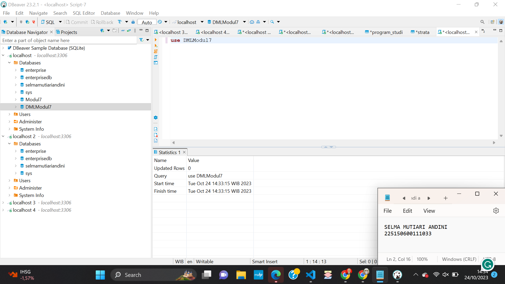

2. Lalu membuat tabel Fakultas sesuai dengan diagram yang ada pada soal.
    ```sql
        create table FAKULTAS(
          ID_FAKULTAS smallint not null primary key,
          FAKULTAS VARCHAR(45)
          )

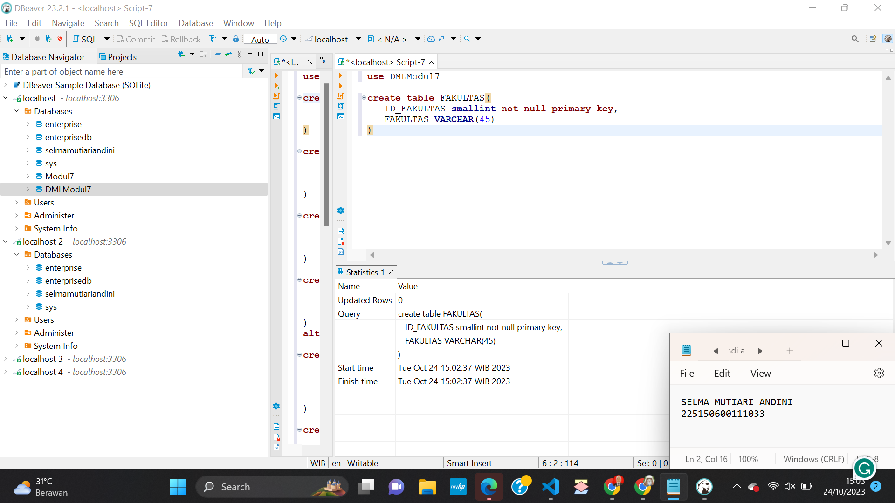

3.  Lalu membuat tabel Jurusan sesuai dengan diagram yang ada pada soal. Tabel ini memiliki foreign key yang references ke tabel Fakultas.
    ```sql
        create table JURUSAN(
          ID_JURUSAN smallint not null primary key,
          JURUSAN VARCHAR(45),
          ID_FAKULTAS smallint references FAKULTAS(ID_FAKULTAS)
          )

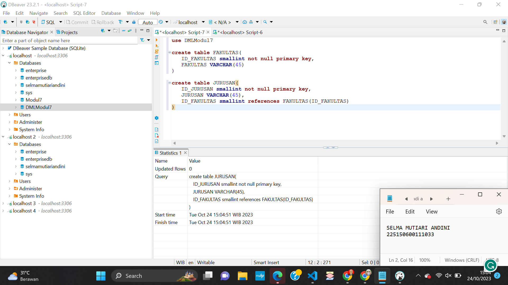

4. Lalu membuat tabel Strata sesuai dengan diagram yang ada pada soal.
    ```sql
        create table STRATA(
          ID_STRATA smallint not null primary key,
          SINGKAT VARCHAR(10),
          STRATA VARCHAR(45)
          )

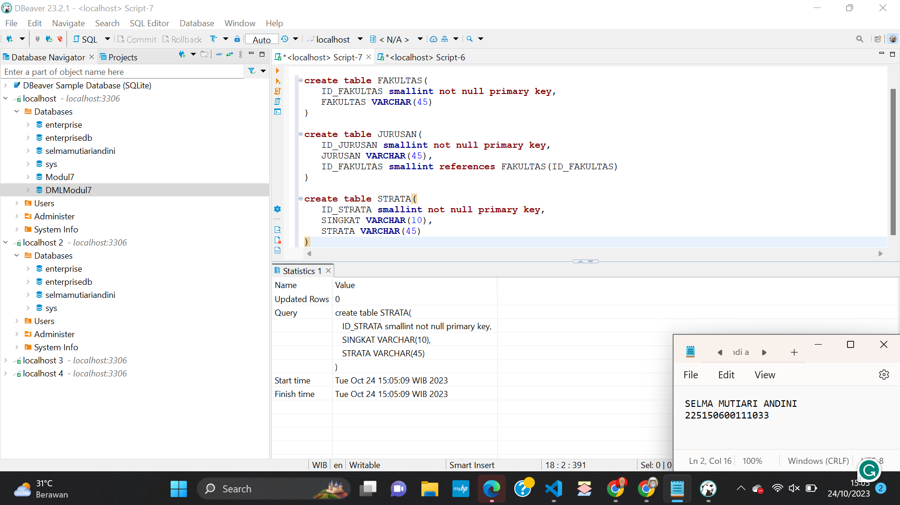

5. Lalu tambahkan tabel SELEKSI_MASUK sesuai dengan diagram yang ada pada soal.
    ```sql
       create table SELEKSI_MASUK(
         ID_SELEKSI_MASUK smallint not null primary key,
         SINGKAT VARCHAR(12),
         SELEKSI_MASUK VARCHAR(60)
         )

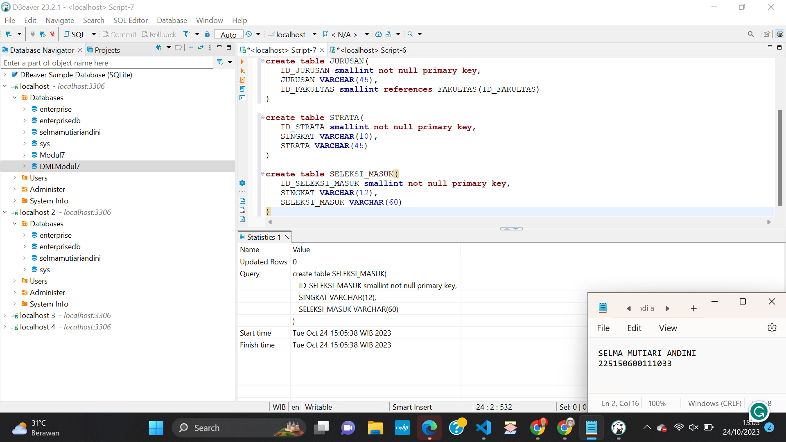

6. Lalu tambahkan tabel PROGRAM_STUDI sesuai dengan diagram yang ada pada soal. Tabel ini memiliki 2 foreign key yaitu ID_STRATA dan ID_JURUSAN.
    ```sql
       create table PROGRAM_STUDI(
         ID_PROGRAM_STUDI smallint not null primary key,
         PROGRAM_STUDI VARCHAR(60),
         ID_STRATA smallint references STRATA(ID_STRATA),
         ID_JURUSAN smallint references JURUSAN(ID_JURUSAN)
         )

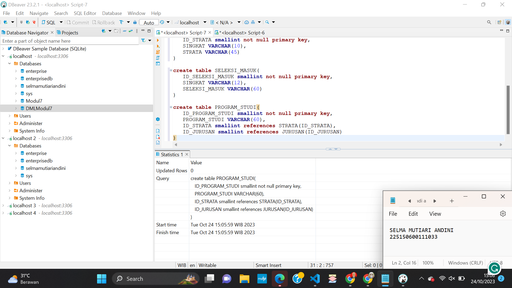

7. Lalu tambahkan tabel MAHASISWA sesuai dengan diagram yang ada pada soal. Tabel ini memiliki 2 foreign key ID_SELEKSI_MASUK DAN ID_PROGRAM_STUDI.
    ```sql
       create table MAHASISWA(
         NIM VARCHAR(15) not null primary key,
         NAMA VARCHAR(45),
         ANGKATAN smallint,
         TGL_LAHIR DATE,
         KOTA_LAHIR VARCHAR(60),
         JENIS_KELAMIN CHAR(1),
         ID_SELEKSI_MASUK smallint references SELEKSI_MASUK(ID_SELEKSI_MASUK),
         ID_PROGRAM_STUDI smallint references PROGRAM_STUDI(ID_PROGRAM_STUDI)
         )

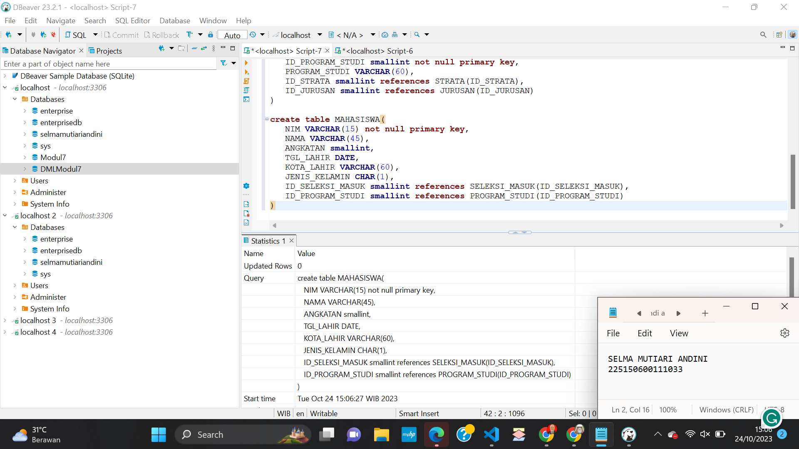

8. Tambahkan data ke dalam tabel Fakultas lalu jalankan baris select agar menampilkan tabel dan isi datanya.
    ```sql
       insert into FAKULTAS(ID_FAKULTAS,FAKULTAS)
       VALUES(1,'Ekonomi & Bisnis'),(2,'Ilmu Komputer');
       select * from FAKULTAS;
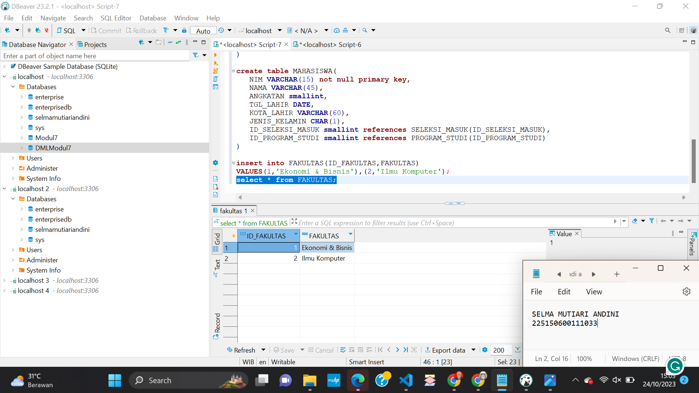

9. Tambahkan data ke dalam tabel Jurusan lalu jalankan baris select agar menampilkan tabel dan isi datanya.
    ```sql
       insert into JURUSAN(ID_JURUSAN, ID_FAKULTAS, JURUSAN)
       VALUES(21,2,'Informatika'), (22,2,'Sistem Informasi'), (23,2,'Teknik Komputer');
       select * from JURUSAN;

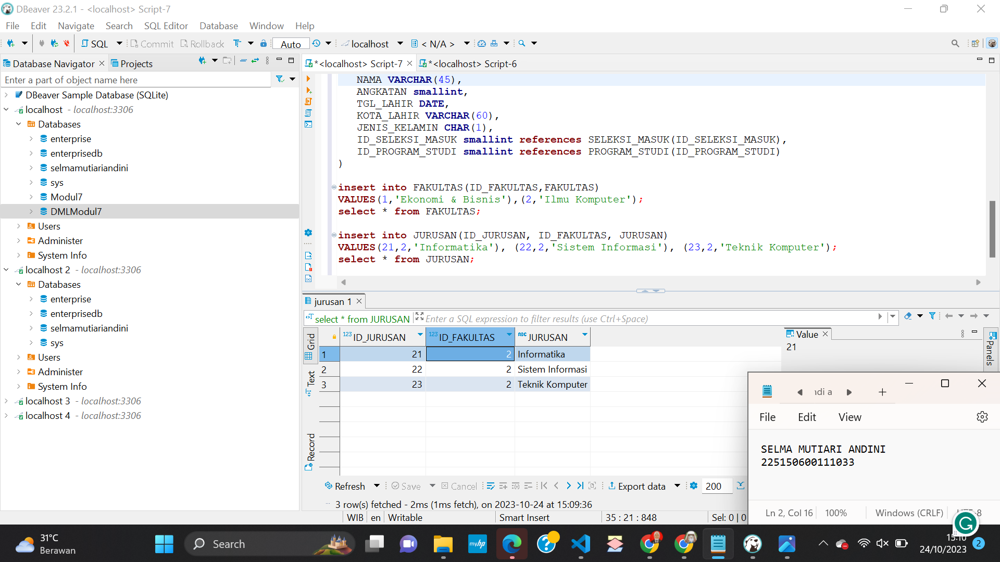

10. Tambahkan data ke dalam tabel Strata lalu jalankan baris select agar menampilkan tabel dan isi datanya.
    ```sql
      insert into STRATA(ID_STRATA, SINGKAT, STRATA)
      VALUES(1, 'D1', 'Diploma'), (2, 'S2', 'Sarjana'), (3,'S2','Magister');
      select *from STRATA;

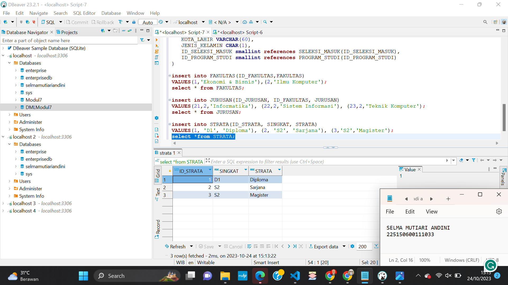

11. Tambahkan data ke dalam tabel Program Studi lalu jalankan baris select agar menampilkan tabel dan isi datanya. Strata saya dahulukan karena didalam tabel ini ada kolom ID_STRATA sehingga baris ini tidak bisa dijalankan terlebih dahulu.
    ```sql
     insert into PROGRAM_STUDI(ID_PROGRAM_STUDI, ID_STRATA, ID_JURUSAN, PROGRAM_STUDI)
     values
     (211,2,21,'Teknik Informatika'),
     (212,2,21,'Teknik Komputer'),
     (219,3,21,'Magister Ilmu Komputer');
    select * from PROGRAM_STUDI;

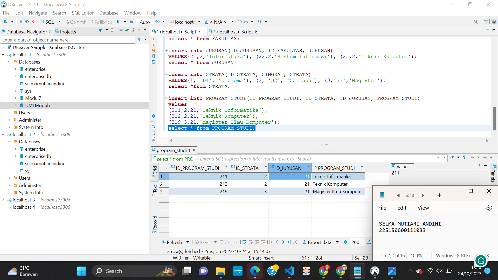

12. Tambahkan data ke dalam tabel Seleksi Masuk lalu jalankan baris select agar menampilkan tabel dan isi datanya.
    ```sql
      insert into SELEKSI_MASUK(ID_SELEKSI_MASUK, SINGKAT, SELEKSI_MASUK)
      VALUES(1,'SNMPTN','SELEKSI NASIONAL MAHASISWA PERGURUAN TINGGI NEGERI'), (2,'SBMPTN','SELEKSI BERSAMA MAHASISWA PERGURUAN TINGGI NEGERI');
      select * from SELEKSI_MASUK;
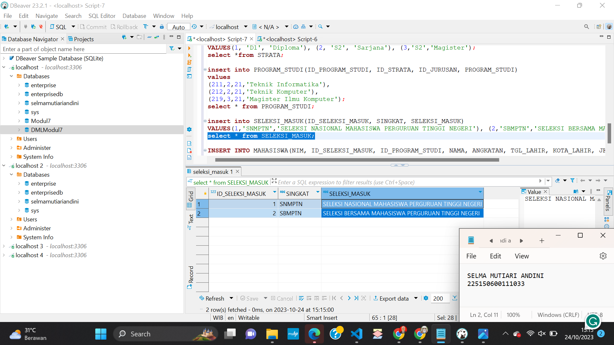

13. Tambahkan data ke dalam tabel Mahasiswa lalu jalankan baris select agar menampilkan tabel dan isi datanya.
    ```sql
      INSERT INTO MAHASISWA(NIM, ID_SELEKSI_MASUK, ID_PROGRAM_STUDI, NAMA, ANGKATAN, TGL_LAHIR, KOTA_LAHIR, JENIS_KELAMIN)
      VALUES('155150400', 1, 211, 'JONI', 2015, '1997-01-01', 'Malang', 'W'), ('155150401', 2, 212, 'JONO', 2015, '1997-10-02', 'Situbondo','P');
      select * from MAHASISWA;
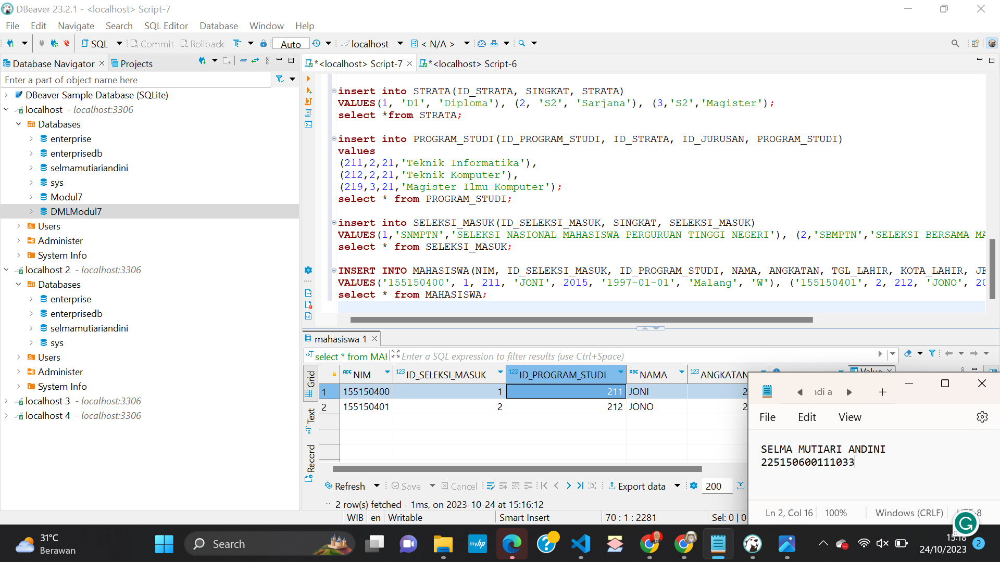
