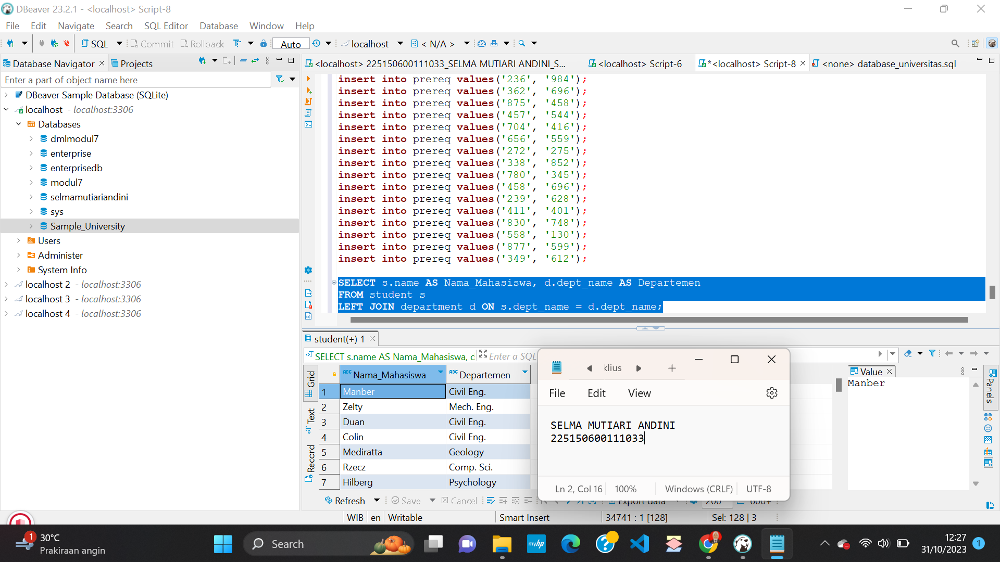

Nama: Selma Mutiari Andini

NIM : 225150600111033

Kelas : DBDSQL PTI A

[Kode SQL](./Tugas4.sql)

Berikut adalah langkah-langkah pengerjaan tugas 4 terkait dengan join.

1. Pertama-tama saya execute semua kode yang diberikan oleh asprak. 
    ```sql
    create database sampel_university;
    use sampel_university;
    
    create table classroom
	(building		varchar(15),
	 room_number		varchar(7),
	 capacity		numeric(4,0),
	 primary key (building, room_number)
	);
    
    create table department
	(dept_name		varchar(20), 
	 building		varchar(15), 
	 budget		        numeric(12,2) check (budget > 0),
	 primary key (dept_name)
	);
    
    create table course
	(course_id		varchar(8), 
	 title			varchar(50), 
	 dept_name		varchar(20),
	 credits		numeric(2,0) check (credits > 0),
	 primary key (course_id),
	 foreign key (dept_name) references department(dept_name)
     on delete set null
	);
    
    create table instructor
	(ID			varchar(5), 
	 name			varchar(20) not null, 
	 dept_name		varchar(20), 
	 salary			numeric(8,2) check (salary > 29000),
	 primary key (ID),
	 foreign key (dept_name) references department(dept_name)
		on delete set null
	);
    
    create table section
	(course_id		varchar(8), 
         sec_id			varchar(8),
	 semester		varchar(6)
		check (semester in ('Fall', 'Winter', 'Spring', 'Summer')), 
	 year			numeric(4,0) check (year > 1701 and year < 2100), 
	 building		varchar(15),
	 room_number		varchar(7),
	 time_slot_id		varchar(4),
	 primary key (course_id, sec_id, semester, year),
	 foreign key (course_id) references course(course_id)
		on delete cascade,
	 foreign key (building, room_number) references classroom(building, room_number)
		on delete set null
	);
    
    create table teaches
	(ID			varchar(5), 
	 course_id		varchar(8),
	 sec_id			varchar(8), 
	 semester		varchar(6),
	 year			numeric(4,0),
	 primary key (ID, course_id, sec_id, semester, year),
	 foreign key (course_id,sec_id, semester, year) references section(course_id,sec_id, semester, year)
		on delete cascade,
	 foreign key (ID) references instructor(ID)
		on delete cascade
	);
    
    create table student
	(ID			varchar(5), 
	 name			varchar(20) not null, 
	 dept_name		varchar(20), 
	 tot_cred		numeric(3,0) check (tot_cred >= 0),
	 primary key (ID),
	 foreign key (dept_name) references department(dept_name)
		on delete set null
	);
    
    create table takes
	(ID			varchar(5), 
	 course_id		varchar(8),
	 sec_id			varchar(8), 
	 semester		varchar(6),
	 year			numeric(4,0),
	 grade		        varchar(2),
	 primary key (ID, course_id, sec_id, semester, year),
	 foreign key (course_id,sec_id, semester, year) references section(course_id,sec_id, semester, year)
		on delete cascade,
	 foreign key (ID) references student(ID)
		on delete cascade
	);
    
    create table advisor
	(s_ID			varchar(5),
	 i_ID			varchar(5),
	 primary key (s_ID),
	 foreign key (i_ID) references instructor(ID)
		on delete set null,
	 foreign key (s_ID) references student(ID)
		on delete cascade
	);
    
    create table time_slot
	(time_slot_id		varchar(4),
	 day			varchar(1),
	 start_hr		numeric(2) check (start_hr >= 0 and start_hr < 24),
	 start_min		numeric(2) check (start_min >= 0 and start_min < 60),
	 end_hr			numeric(2) check (end_hr >= 0 and end_hr < 24),
	 end_min		numeric(2) check (end_min >= 0 and end_min < 60),
	 primary key (time_slot_id, day, start_hr, start_min)
	);
    
    create table prereq
	(course_id		varchar(8), 
	 prereq_id		varchar(8),
	 primary key (course_id, prereq_id),
	 foreign key (course_id) references course(course_id)
		on delete cascade
	);

Kode akan menjalankan baris pertama yaitu membuat database dan menggunakan sampel_university. Lalu kode akan membuat masing-masing tabel dengan syntax create table.
   
2. Lalu setelah itu kode akan menjalankan baris insert into yang berfungsi untuk memasukkan nilai kedalam tabel.
   ```sql
   insert into time_slot values ( 'A', 'M', 8, 0, 8, 50);

 Diatas adalah salah satu contoh syntax insert into.

3. Setelah semua kode berhasil dijalankan, maka akan muncul pemberitahuan seperti gambar dibawah ini.


4. Setelah itu saya menampilkan semua nama mahasiswa beserta nama departemennya dengan menggunakan syntax
     ```sql
     SELECT s.name AS Nama_Mahasiswa, d.dept_name AS Departemen
     FROM student s
     LEFT JOIN department d ON s.dept_name = d.dept_name;
 
 Syntax diatas menggunakan left join untuk menampilkan nama mahasiswa beserta departemennya. Lalu jika baris diatas dijalankan akan mengeluarkan output seperti dibawah ini.
 

5. Lalu saya menampilkan semua nama student beserta nama department yang memiliki total SKS (total credit) lebih dari 100 dengan syntax dibawah ini.
     ```sql
     SELECT s.name AS Nama_Mahasiswa, d.dept_name AS Departemen
     FROM student s
     INNER JOIN department d ON s.dept_name = d.dept_name
     WHERE s.tot_cred > 100;
Syntax diatas menggunakan inner join agar sesuai dengan permintaan pada soal. Jika syntax diatas dijalankan  maka akan mengeluarkan output dibawah ini.


6. Untuk soal yang terakhir adalah menampilkan nama student dan nama instructor yang bekerja pada department yang sama. Saya menggunakan inner join untuk membuatnya.
     ```sql
     SELECT s.name AS Nama_Mahasiswa, i.name AS Nama_Instructor, s.dept_name AS Departemen
     FROM student s
     INNER JOIN instructor i ON s.dept_name = i.dept_name;
Jika syntax diatas dijalankan maka akan muncul output seperti dibawah ini.
