Nama         : Selma Mutiari Andini

NIM          : 225150600111033

Kelas        : DBDSQL PTI A

[Kode SQL Tugas 5](./Tugas5.sql)

Berikut adalah langkah-langkah pengerjaan tugas 5 tentang fungsi skalar dan fungsi agregasi.

1. Pertama-tama saya menjalankan perintah dibawah ini untuk menampilkan nama dan departemen dari tabel student.
    ```sql
    select CONCAT (name,'   ', dept_name) as Profile
    from student;
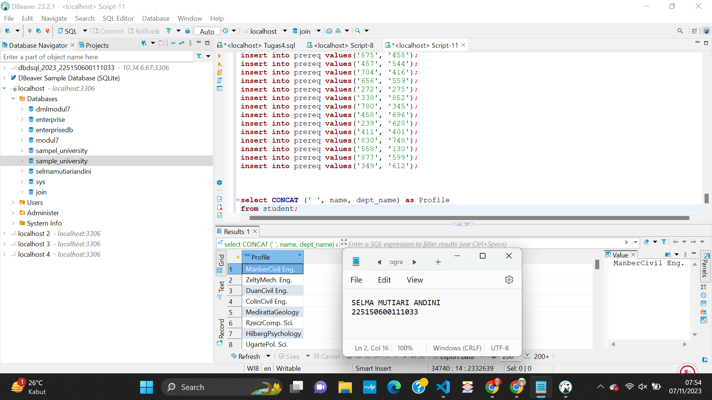

2. Setelah itu saya menampilkan matkul dengan mengambil 3 kata pertama dengan syntax dibawah ini.
    ```sql
    select substring_index(title, ' ', 3) as MATKUL
    from course;
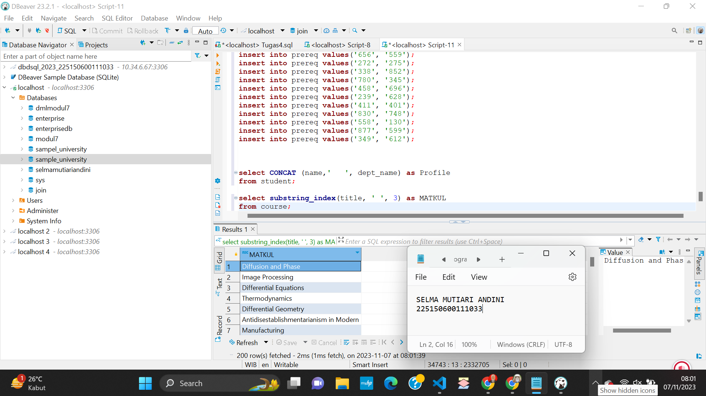

3. Untuk yang selanjutnya saya menampilkan nama departemen dengan mengambil 3 huruf depannya saja dengan syntax dibawah ini.
    ```sql
    select SUBSTR(DEPT_NAME, 1, 3) as PRODI
    from student;
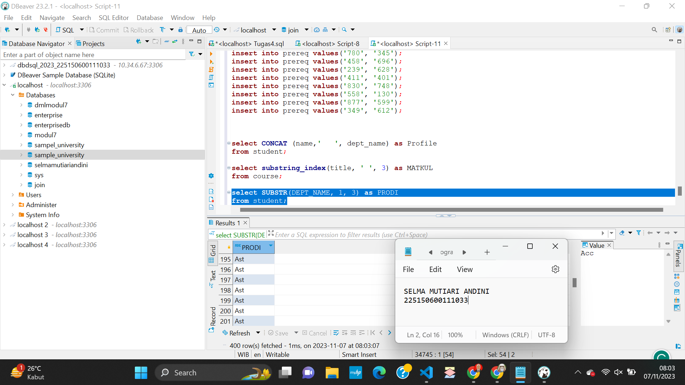

4. Selanjutnya saya menampilkan banyaknya karakter untuk setiap data dengan menggunakan syntax dibawah ini.
    ```sql
    select length(dept_name)
    from student;
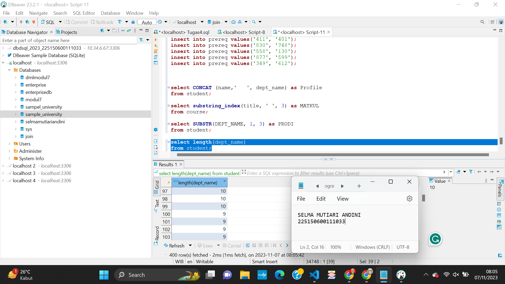

5. Selanjutnya saya mengganti nama Duan menjadi Selma pada tabel student dengan syntax dibawah ini.
    ```sql
    select name, replace(name, 'Duan', 'Selma') as Nama_yg_diganti
    from student;
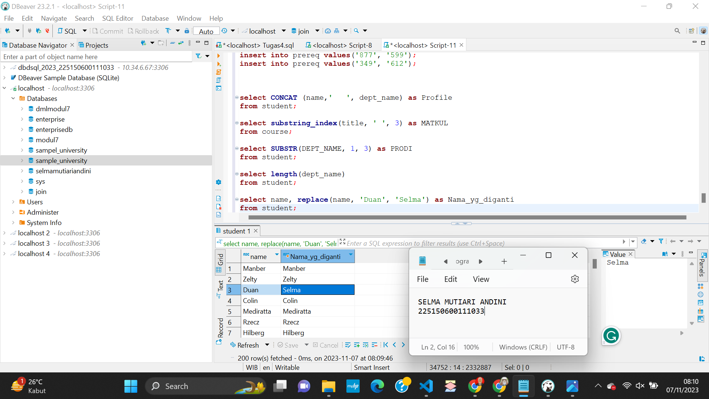

6. Selanjutnya saya menampilkan nilai absolut kolom i_ID dari tabel advisor menggunakan syntax dibawah ini.
    ```sql
    select abs(i_ID)
    from advisor;
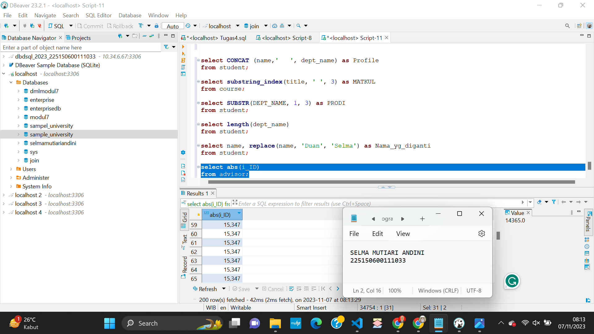

7. Setelah itu saya menampilkan nilai integer terbesar dari nilai data pada kolom course_id yang berasal dari tabel takes dengan menggunakan syntax dibawah ini.
    ```sql
    select ceiling(course_id)
    from takes;
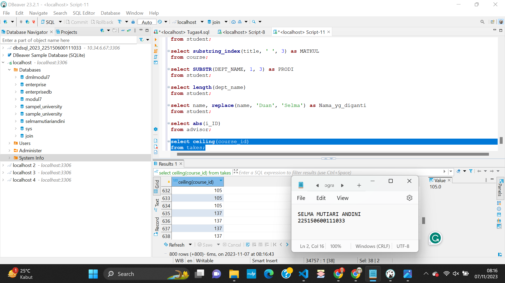

8. Setelah itu saya menggunakan syntax floor yang berfungsi untuk mengembalikan nilai integer terkecil dari suatu nilai pada kolom course_id dalam tabel takes. 
     ```sql
     select floor(course_id)
     from takes;
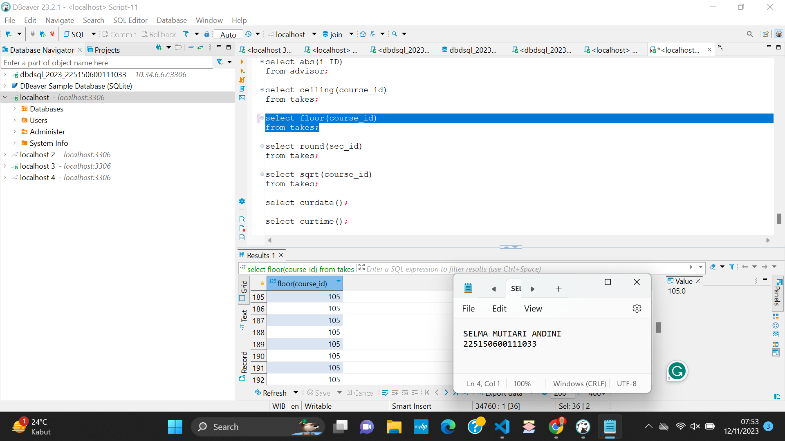

9. Selanjutnya saya mencoba untuk membulatkan nilai desimal dengan menggunakan syntax Round.
     ```sql
     select round(sec_id)
     from takes;
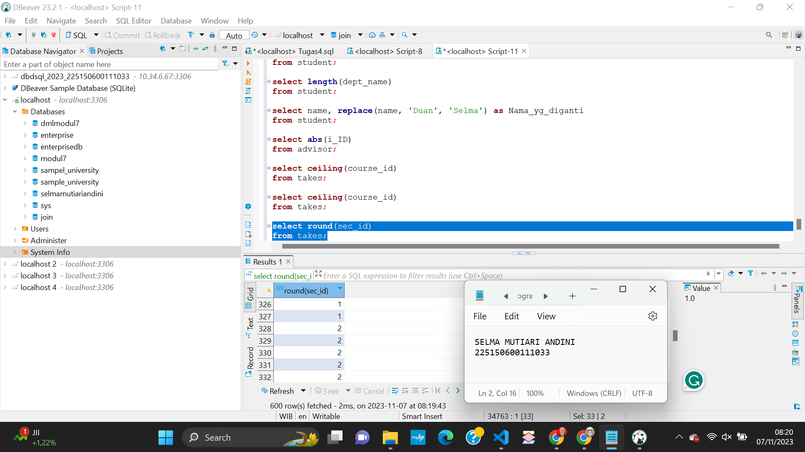

10. Setelah itu saya menggunakan syntax sqrt untuk mencari nilai kuadrat dari kolom course_id dalam yang terdapat pada tabel takes.
     ```sql
     select sqrt(course_id)
     from takes;
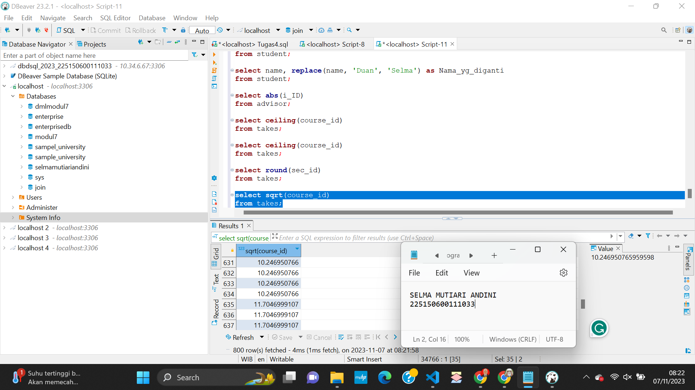

11. Syntax curdate digunakan untuk menampilkan hari saat ini. Ketika syntax ini dijalankan maka akan muncul seperti pada gambar.
     ```sql
     select curdate();
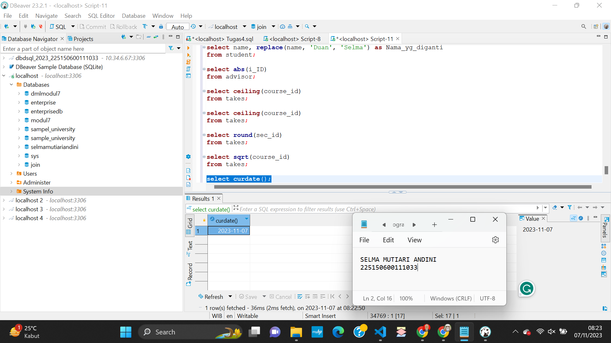

12. Syntax curtime berfungsi untuk menampilkan waktu pada saat ini atau pada saat syntax tersebut dijalankan.
     ```sql
     select curtime();
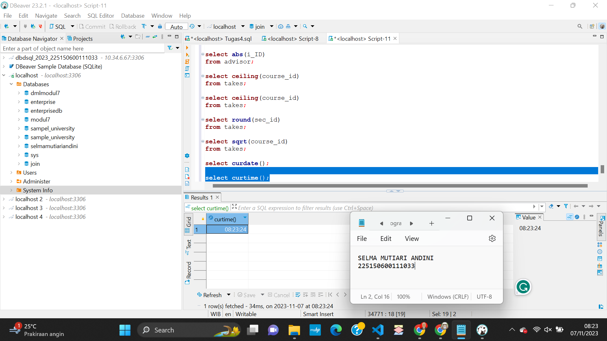

13. Syntax timestamp digunakan untuk menampilkan tanggal dan waktu dengan format tahun, tanggal, hari, serta dengan format jam, menit dan detik yang telah ditentukan.
     ```sql
     select timestamp("2021-10-10", 12.00);
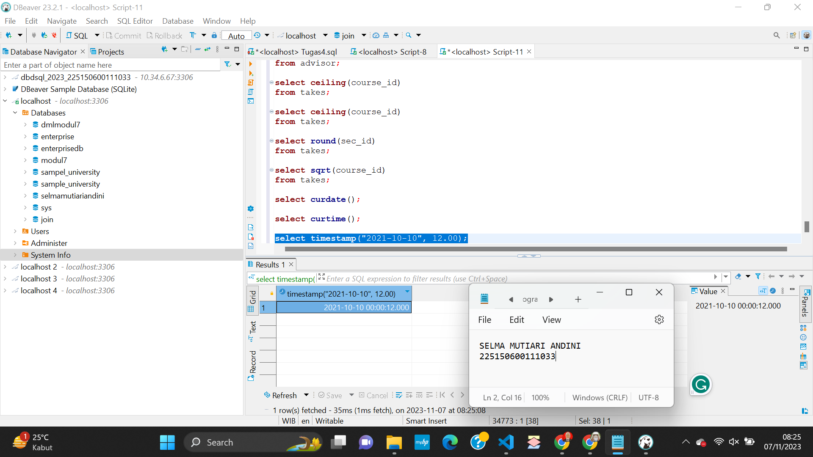

14. Selanjutnya saya menggunakan syntax sum yang berfungsi untuk menjumlahkan nilai pada kolom course_id yang ada pada tabel takes.
     ```sql
     select sum(course_id)
     from takes;
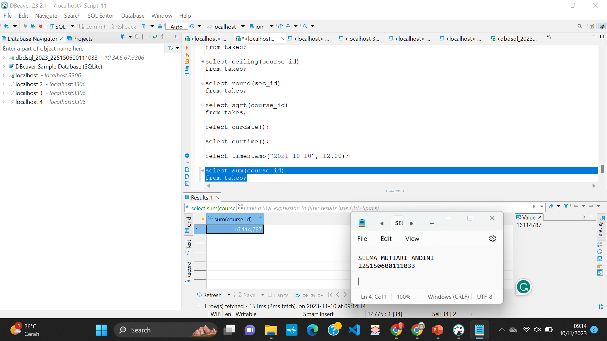

15. Setelah itu saya menggunakan syntax avg untuk mengambil nilai rata-rata dari semua kolom course_id yang ada dalam tabel takes.
     ```sql
     select avg(course_id)
     from takes;
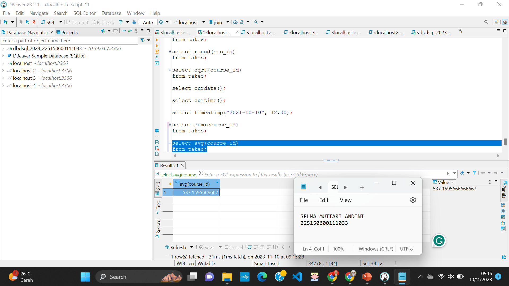

16. Lalu saya menggunakan syntax count untuk menghitung banyaknya baris dari kolom course_id yang ada pada tabel takes.
     ```sql
     select count(sec_id)
     from takes;
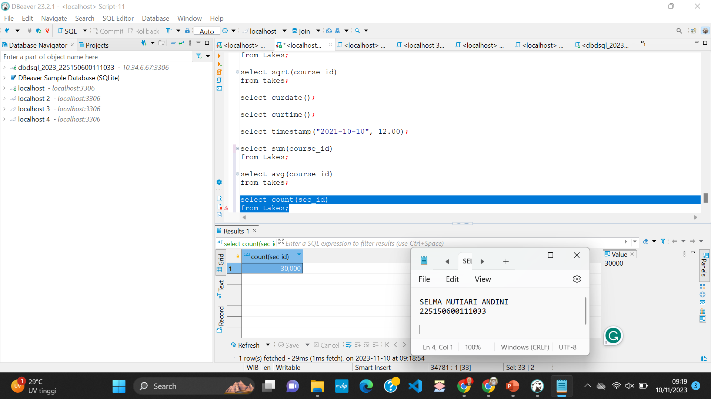

17. Setelah itu saya mencoba untuk menampilkan nilai rata-rata dari sec_id didalam tabel takes, lalu akan menampilkan nilai rata-rata dengan kondisi lebih dari 2 dengan klausa having.
      ```sql
      SELECT AVG(sec_id), sec_id
      FROM takes
      GROUP BY sec_id
      HAVING AVG(sec_id) > 2;
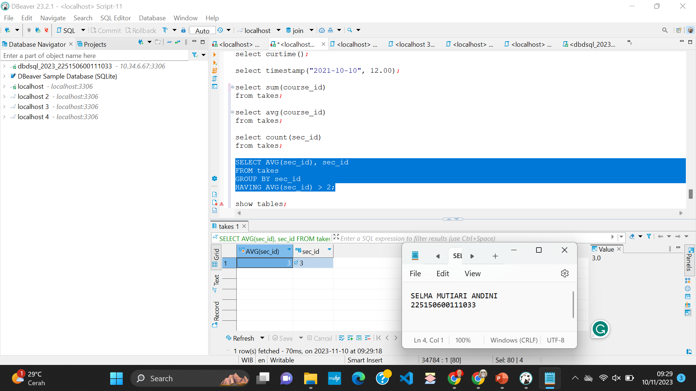